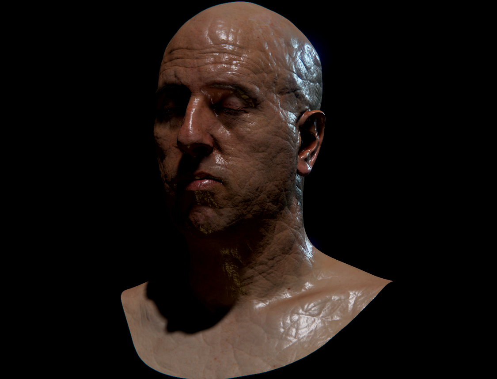
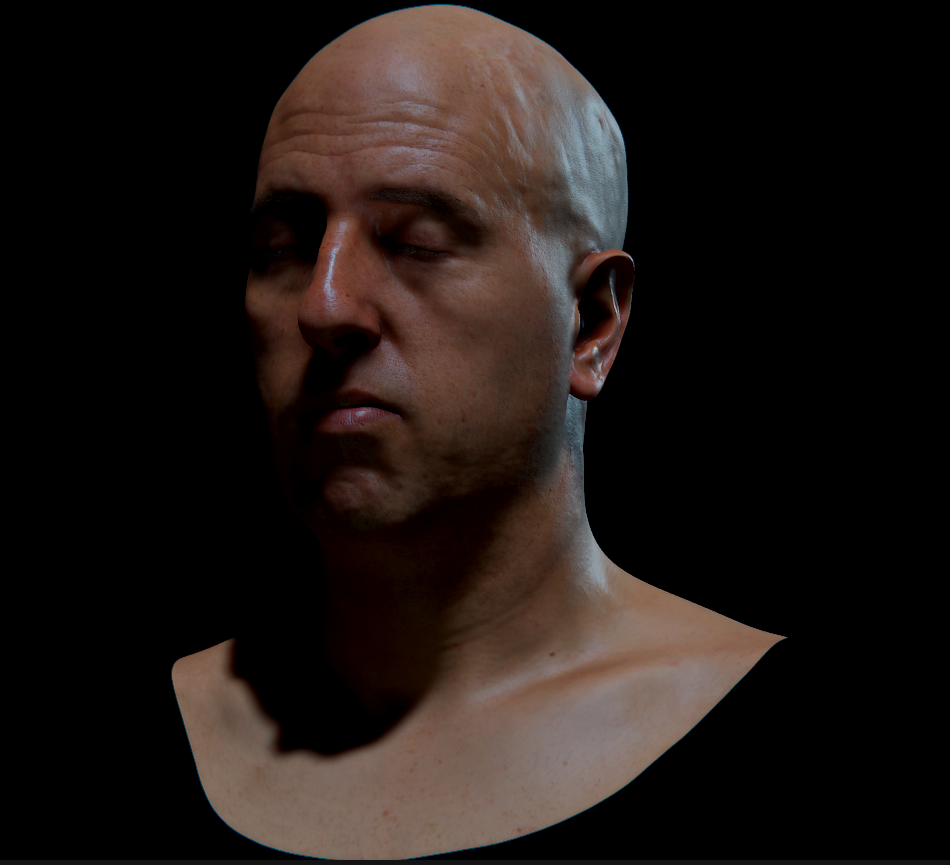
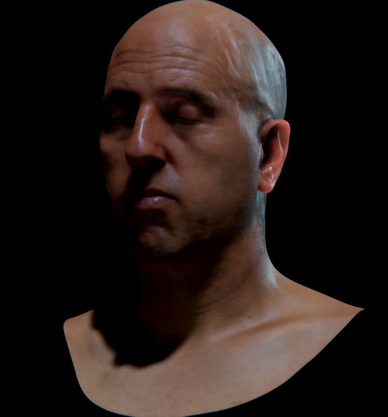
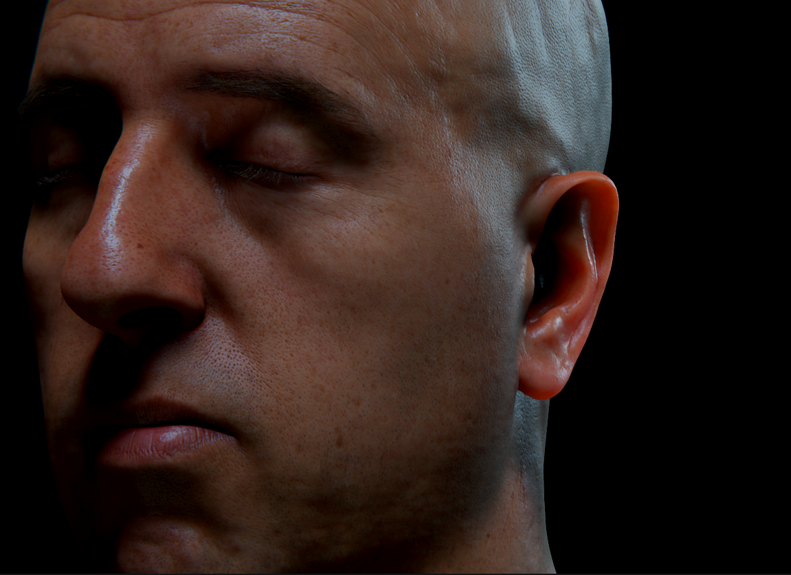
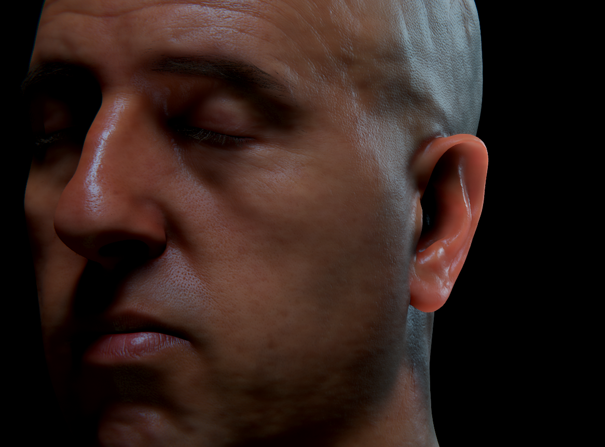
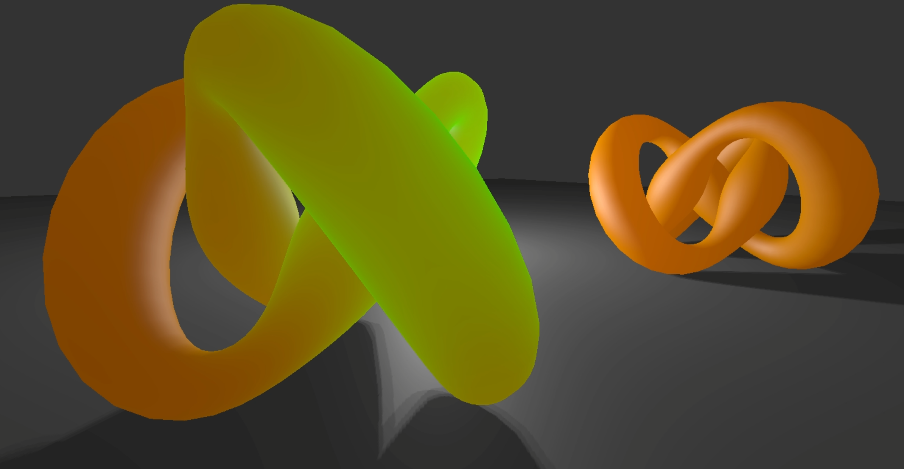

## 次表面散射：

技术博客：[https://github.com/Li-ZhuoHang/Subsurface_scattering)](https://github.com/Li-ZhuoHang/Subsurface_scattering)

### 基于屏幕空间模糊的次表面散射(SSSSS)：

#### 效果展示：

原模型：



#### 开启镜面表面反射



```
float PHBeckmann ( float ndoth, float m )
{
	float alpha = acos ( ndoth );
	float ta = tan ( alpha );
	float val = 1.0/ (m*m*pow (ndoth,4.0))*exp (- (ta*ta)/ (m*m));
	return val;
}
//染一个与屏幕对齐的方框来对一个512X512的纹理进行预计算
float KSTextureCompute(float2 tex :TEXCOORDO)
{
	//缩放结果到[0,1]范围——用于倒置查找
	return 0.5 * pow( PHBeckmann( tex.x, tex.y ),0.1 );
}

//使用预计算的Beckmann纹理得到 Kelemen/Szirmay-Kalos镜面模型                    
float KS Skin Specular( float3 N,1/凸起的表面法线
						loat3 L,//点到光线的方向
						float3 V,//点到视点的方向
						float m,//粗糙度
	·					float rho s,//镜面光亮度
						uniform texobj2D beckmannTex )
float result =	0.0;
loat ndotl = dot( N,L );
if( ndotl >0.0 )
{
	float3 h = L+V;//未归一化的半角向量
	float3 H = normalize( h );
	float ndoth = dot( N,H);
	float PH = pow(2.0*f1tex2D (beckmannTex, loat2 (ndoth,m) ),10.0 ) ;
	float F = fresnelReflectance( H,V,0.028 );
	float frSpec = max( PH*F/ dot( h, h)，0);
	result= ndotl *rho s*frSpec;//
}
	return result;
}
```

#### 提取皮肤遮罩

这里为了简单方便，直接采用Command Buffer提取需要次表面散射的对象Mask遮罩。
注意这里用了一个纯色Shader处理

C# 代码：

```
// 纯色Shader
Shader purecolorShader = Shader.Find("lcl/Common/PureColor");
// Shader purecolorShader = Shader.Find("lcl/Common/VertexColor");

if (purecolorMaterial == null)
    purecolorMaterial = new Material(purecolorShader);

if (maskTexture == null)
    maskTexture = RenderTexture.GetTemporary(Screen.width, Screen.height, 16, RenderTextureFormat.ARGB32, RenderTextureReadWrite.Default, 4);

commandBuffer = new CommandBuffer();
commandBuffer.SetRenderTarget(maskTexture);
commandBuffer.ClearRenderTarget(true, true, Color.black);
for (var i = 0; i < targetObjects.Length; i++)
{
    Renderer[] renderers = targetObjects[i].GetComponentsInChildren<Renderer>();
    foreach (Renderer r in renderers)
        commandBuffer.DrawRenderer(r, purecolorMaterial);
}
```


#### 开启高斯模糊后处理：



#### 开启透视

左边：开启透视、右边：关闭透视



再开启Subsurface albedo



```
//动态Transmission
//L光照方向  N是法线 E是摄像机方向 atten是光照衰减
float3 TransmissionDynamic(float3 color, float3 L, float3 N, float3 E, float NdotL, fixed atten)
{
    color = 1.0 - exp(-color);
    half blV = saturate (dot(-E, (L + N))) * 2;
    half bnL = saturate (dot(N, -L ) * TransmissionRange + TransmissionRange);
    //bnL = bnL * (NdotL/* * 0.5 + 0.5*/);
    
    half3 light = bnL + blV;
    half3 Subsurface = color * light * 10;
    Subsurface /= 1.0 -  color;
	Subsurface = 1.0 - exp(-Subsurface);
	Subsurface = Subsurface * light * lerp(1.0, atten, TransmissionShadows) * 10 * color * DynamicPassTransmission;

	return Subsurface;
}
```

具体的公式可以参考这篇文章：https://zhuanlan.zhihu.com/p/482875191

### 次表面散射的其它方案：

#### 快速次表面：



